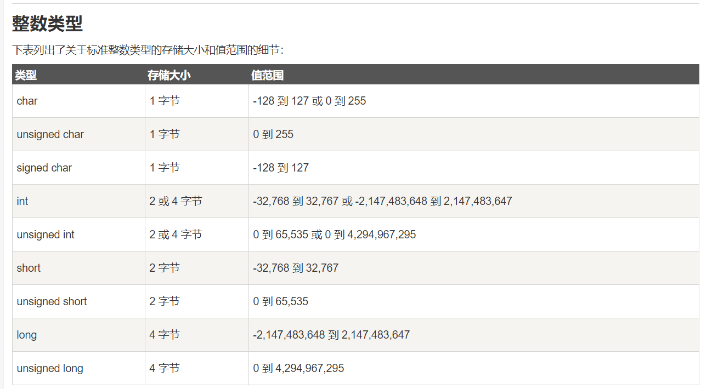
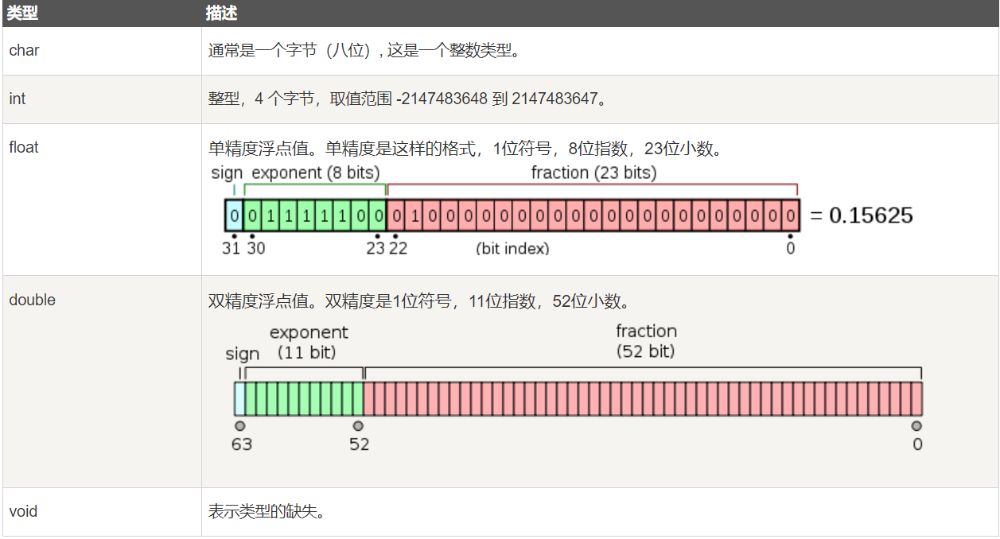
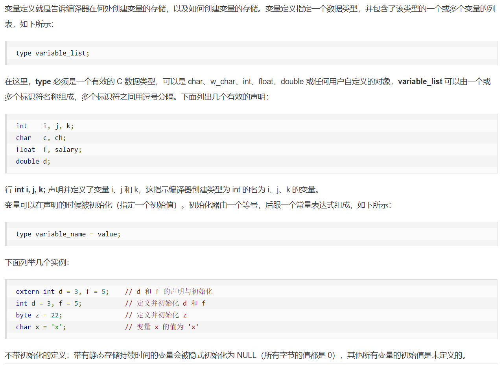
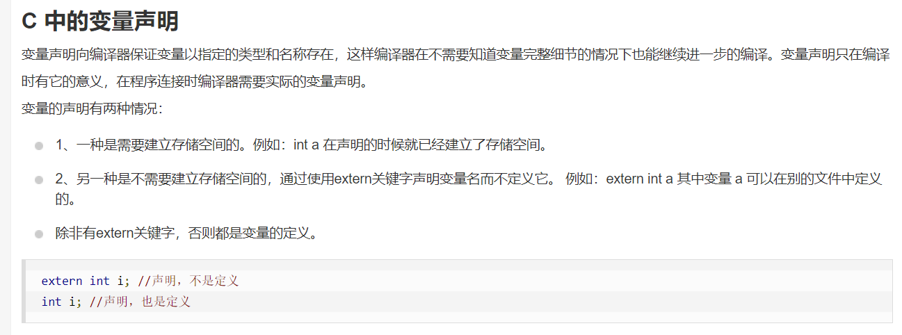
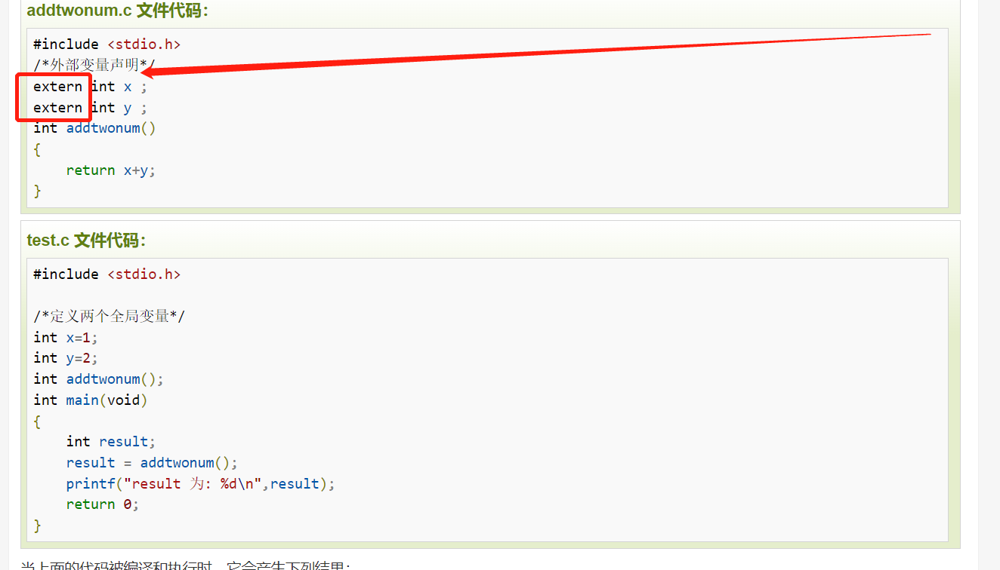

数据类型：
        基本数据类型：整型 int;字符型 char;浮点型 float;双精度浮点型 double;
        枚举类型;
        void类型;
        派生类型;

类型转换：
        隐式类型转换：隐式类型转换是在表达式中自动发生的，无需进行任何明确的指令或函数调用。它通常是将一种较小的类型自动转换为较大
    的类型，例如，将int类型转换为long类型或float类型转换为double类型。隐式类型转换也可能会导致数据精度丢失或数据截断。
        显式类型转换：显式类型转换需要使用强制类型转换运算符（type casting operator），它可以将一个数据类型的值强制转换为另一
    种数据类型的值。强制类型转换可以使程序员在必要时对数据类型进行更精确的控制，但也可能会导致数据丢失或截断。

变量：
     变量其实只不过是程序可操作的存储区的名称。C 中每个变量都有特定的类型，类型决定了变量存储的大小和布局，该范围内的值都可以存储在
   内存中，运算符可应用于变量上。
    变量的名称可以由字母、数字和下划线字符组成。它必须以字母或下划线开头。大写字母和小写字母是不同的，因为 C 是大小写敏感的。基于前一章讲
  解的基本类型，有以下几种基本的变量类型：
    
C中的变量定义：
C中的变量声明：
如果需要在一个源文件中引用另外一个源文件中定义的变量，我们只需在引用的文件中将变量加上 extern 关键字的声明即可。
    

C 中的左值（Lvalues）和右值（Rvalues）
    左值（lvalue）：指向内存位置的表达式被称为左值（lvalue）表达式。左值可以出现在赋值号的左边或右边。
    右值（rvalue）：术语右值（rvalue）指的是存储在内存中某些地址的数值。右值是不能对其进行赋值的表达式，也就是说，右值可以出现在赋值号的右边，
但不能出现在赋值号的左边。
    变量是左值，因此可以出现在赋值号的左边。数值型的字面值是右值，因此不能被赋值，不能出现在赋值号的左边。下面是一个有效的语句：
    
        